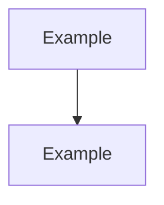

# Phase NN: <Short Title>

## What was built
<!-- One paragraph. What exists now that did not before. -->

## Why these decisions were made
<!-- Bullet list. Key choices and reasoning. Not "what" — only "why". -->

- **Decision** — reason.

## Architecture diagram
<!-- One Mermaid diagram scoped to this phase only. 3–7 nodes. -->

## Files added or changed

| File | Change | Notes |
|---|---|---|
| `path/to/file` | Added / Modified | One-line context |

## Tests added
<!-- List only tests that encode a meaningful decision. -->

- `ClassName.MethodName` — what it verifies.

> [!NOTE]
> Leave this section empty if no tests were added this phase.

## Known limitations / deferred decisions
<!-- Anything intentionally left incomplete. -->

- **Item** — why it was deferred.

## Next phase depends on
<!-- What the next phase builds on from this one. One or two sentences. -->
