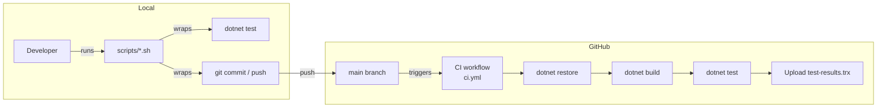

# Phase 00: Setup — Git, Scripts & CI

## What was built
The repository foundation: a local git repo wired to GitHub, a `.gitignore` and `.gitattributes` for consistent cross-platform behaviour, four shell scripts for the daily development workflow, and a GitHub Actions CI pipeline that runs on every push and pull request to `main`.

## Why these decisions were made

- **`ubuntu-latest` for CI runner** — plain .NET class library tests need no platform-specific tooling. Ubuntu is the fastest and cheapest GitHub-hosted runner (Windows costs 2×, macOS 10× free-tier minutes).
- **Scoped CI to `PlantPal.Tests` only** — the main MAUI project requires Android/iOS workloads not available on Ubuntu. Scoping avoids false failures while the app scaffold doesn't exist yet.
- **`actions/cache@v4` keyed on `**/*.csproj` hash** — NuGet lock files don't exist yet. Caching on csproj content still saves 30–60 s on cold restores and is replaced with lock-file caching in Phase 1.
- **`concurrency` cancel-in-progress** — prevents stale CI runs from consuming minutes when a new push supersedes an in-flight one.
- **`.gitattributes` with explicit `eol=lf` for shell scripts** — ensures `.sh` files keep Unix line endings when checked out on Windows, preventing `\r` characters that break bash execution.
- **`commit-phase.sh` runs tests before committing** — enforces the project rule that `main` is always green by making it structurally impossible to commit without a passing test run.

## Architecture diagram

## Files added or changed

| File | Change | Notes |
|---|---|---|
| `.gitignore` | Added | Excludes build outputs, IDE files, secrets, binaries |
| `.gitattributes` | Added | Enforces LF line endings; prevents CRLF in shell scripts |
| `scripts/test-all.sh` | Added | Runs full test suite once with TRX output |
| `scripts/watch-tests.sh` | Added | Reruns tests on file save via `dotnet watch` |
| `scripts/commit-phase.sh` | Added | Tests → commit → push in one guarded command |
| `scripts/new-branch.sh` | Added | Creates feature branch from up-to-date `main` |
| `.github/workflows/ci.yml` | Added | GitHub Actions CI: restore, build, test, upload artifact |
| `CLAUDE.md` | Modified | Setup phase checked off in build status checklist |

## Tests added

> [!NOTE]
> No tests in this phase — no application code exists yet.

## Known limitations / deferred decisions

- **CI will fail until Phase 1** — `PlantPal.Tests/PlantPal.Tests.csproj` does not exist yet. The CI restore step fails by design until the scaffold is created.
- **NuGet cache uses csproj hash** — will be upgraded to lock-file-based caching in Phase 1 once the test project csproj is created.
- **No branch protection rules** — GitHub branch protection (require CI to pass before merge) should be enabled manually in the repo settings once CI is reliably green.

## Next phase depends on
Phase 1 creates the MAUI app scaffold, the test project, and all service interfaces. The CI pipeline will become fully green once `PlantPal.Tests/PlantPal.Tests.csproj` exists and builds successfully.
