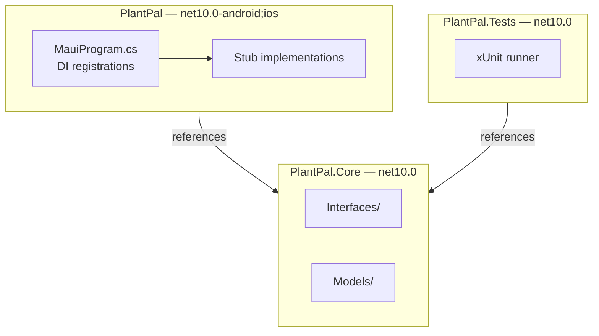

# Phase 01: Solution Scaffold, Interfaces & Test Project

## What was built
A three-project .NET 10 solution: `PlantPal.Core` (plain classlib holding all interfaces and models), `PlantPal` (the MAUI app with stub DI registrations), and `PlantPal.Tests` (xUnit test project). All 8 service interfaces and 4 model classes are defined and compiled. The test runner executes cleanly with 0 tests — the foundation every subsequent phase builds on.

## Why these decisions were made

- **3-project structure (`PlantPal.Core`)** — The MAUI app targets `net10.0-android;net10.0-ios`. A plain `net10.0` xUnit project cannot reference a multi-TFM MAUI project — .NET rejects the reference at build time due to target framework mismatch. Extracting interfaces and models into a separate `net10.0` classlib (`PlantPal.Core`) is the standard solution: both the MAUI app and the test project reference Core, which has no platform dependencies.
- **.NET 10 instead of .NET 9** — Only .NET 10.0.201 SDK is installed on this machine. .NET 10 is the current release; there is no reason to install .NET 9 alongside it.
- **`sqlite-net-pcl` in `PlantPal.Core`** — `Plant.cs` and `WateringLog.cs` use `[SQLite.PrimaryKey]` and `[SQLite.AutoIncrement]` attributes. These types live in `sqlite-net-pcl`, so Core needs the package reference even though Core contains no database logic.
- **Stub implementations in `MauiProgram.cs`** — Each interface needs a registered concrete before the app can start. Private sealed stub classes satisfy DI registration with empty no-op bodies. They are replaced one by one in subsequent phases, keeping the app always runnable throughout development.
- **`.slnx` solution format** — .NET 10's `dotnet new sln` generates the new XML-based `.slnx` format by default. It is fully supported by Visual Studio 2022 and the `dotnet sln` CLI. No action needed — noted here to avoid future confusion.
- **`commit-phase.sh` fixed for new branches** — The original script used plain `git push`, which fails on branches with no upstream. Fixed to always use `git push --set-upstream origin <branch>` so every `commit-phase.sh` call works on both new and existing branches.

## Architecture diagram

## Files added or changed

| File | Change | Notes |
|---|---|---|
| `PlantPal.slnx` | Added | Solution file (.NET 10 XML format) |
| `PlantPal.Core/PlantPal.Core.csproj` | Added | `net10.0` classlib, references `sqlite-net-pcl` |
| `PlantPal.Core/Models/Plant.cs` | Added | Id, Name, Species, Location, WateringIntervalDays, LastWateredDate, NextWaterDate, PhotoPath + `RecalculateNextWaterDate()` |
| `PlantPal.Core/Models/WateringLog.cs` | Added | Id, PlantId, WateredAt |
| `PlantPal.Core/Models/PlantSpecies.cs` | Added | Id, CommonName, LatinName, WateringIntervalDays, WikipediaSlug, ThumbnailAssetPath, DetailAssetPath |
| `PlantPal.Core/Models/PermissionResult.cs` | Added | Enum: Granted, Denied, DeniedPermanently |
| `PlantPal.Core/Interfaces/IPlantRepository.cs` | Added | CRUD for Plant |
| `PlantPal.Core/Interfaces/IWateringLogRepository.cs` | Added | CRUD for WateringLog |
| `PlantPal.Core/Interfaces/INotificationService.cs` | Added | Schedule / cancel / reschedule reminders |
| `PlantPal.Core/Interfaces/IPermissionService.cs` | Added | Check and request notification + photo permissions |
| `PlantPal.Core/Interfaces/IImageCacheService.cs` | Added | Thumbnail and detail image resolution |
| `PlantPal.Core/Interfaces/IConnectivityService.cs` | Added | Network access wrapper |
| `PlantPal.Core/Interfaces/IPlantSpeciesService.cs` | Added | 40-species list access |
| `PlantPal.Core/Interfaces/INavigationService.cs` | Added | Shell navigation wrapper |
| `PlantPal/PlantPal.csproj` | Added | MAUI app project (generated by `dotnet new maui`) |
| `PlantPal/MauiProgram.cs` | Modified | Added `.UseMauiCommunityToolkit()`, stub DI registrations for all 8 interfaces |
| `PlantPal.Tests/PlantPal.Tests.csproj` | Added | xUnit project with NSubstitute, references `PlantPal.Core` |
| `scripts/commit-phase.sh` | Modified | Fixed `git push` to use `--set-upstream origin` for new branches |
| `CLAUDE.md` | Modified | Updated project structure to 3-project layout; updated interface location note |
| `PACKAGES.md` | Modified | All packages marked Yes with actual installed versions |
| `BUILD_STATUS.md` | Modified | MVP Phase 1 checked off |

## Tests added

> [!NOTE]
> No tests in this phase — interfaces and models are contracts, not logic. Tests begin in Phase 02.

## Known limitations / deferred decisions

- **CI still fails on restore** — `ci.yml` restores `PlantPal.Tests/PlantPal.Tests.csproj`. Now that the file exists, CI should pass. The cache key (`**/*.csproj` hash) will now be effective.
- **MauiProgram.cs stub classes** — All 8 stub implementations return empty/false/null. They are intentional placeholders and will be replaced phase by phase.
- **`PlantPal/` not yet used** — The MAUI app project exists but has no real pages or ViewModels. The generated `MainPage.xaml` remains untouched until Phase 05.
- **SQLite Alpine RID warning (NETSDK1206)** — Appears during `dotnet build` on `sqlite-net-pcl`. Harmless on Windows/Android/iOS targets. Documented in `PACKAGES.md`.

## Next phase depends on
Phase 02 uses `IPlantSpeciesService` and `PlantSpecies` from `PlantPal.Core` to build `PlantSpeciesService` via TDD. The test project now has full access to Core interfaces and can import NSubstitute for mocking.
